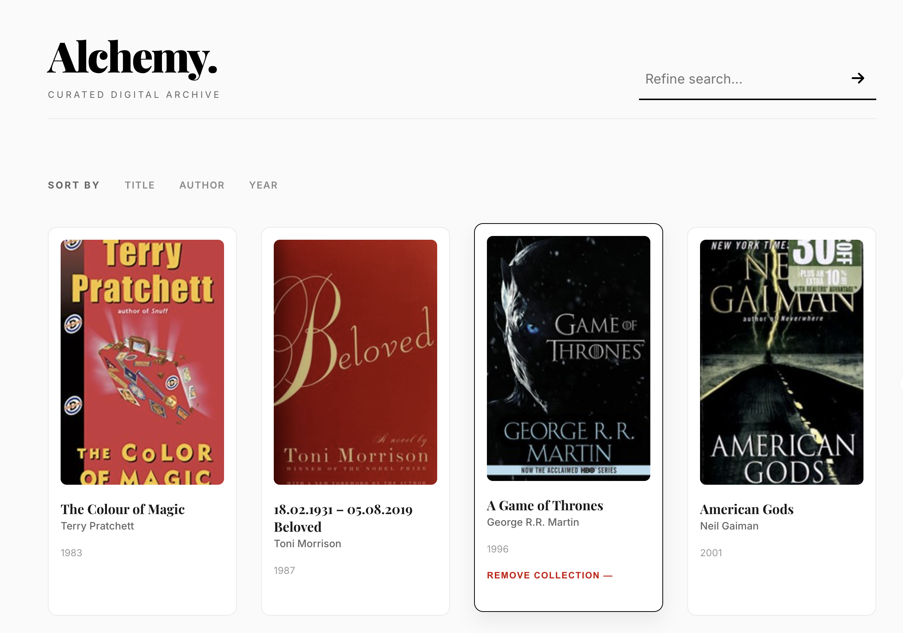
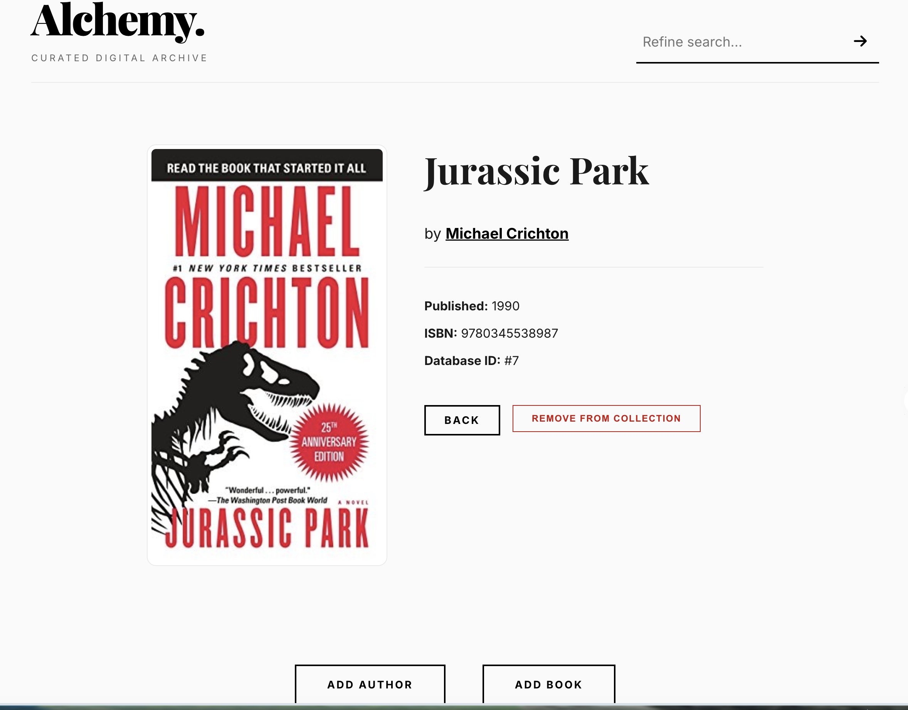
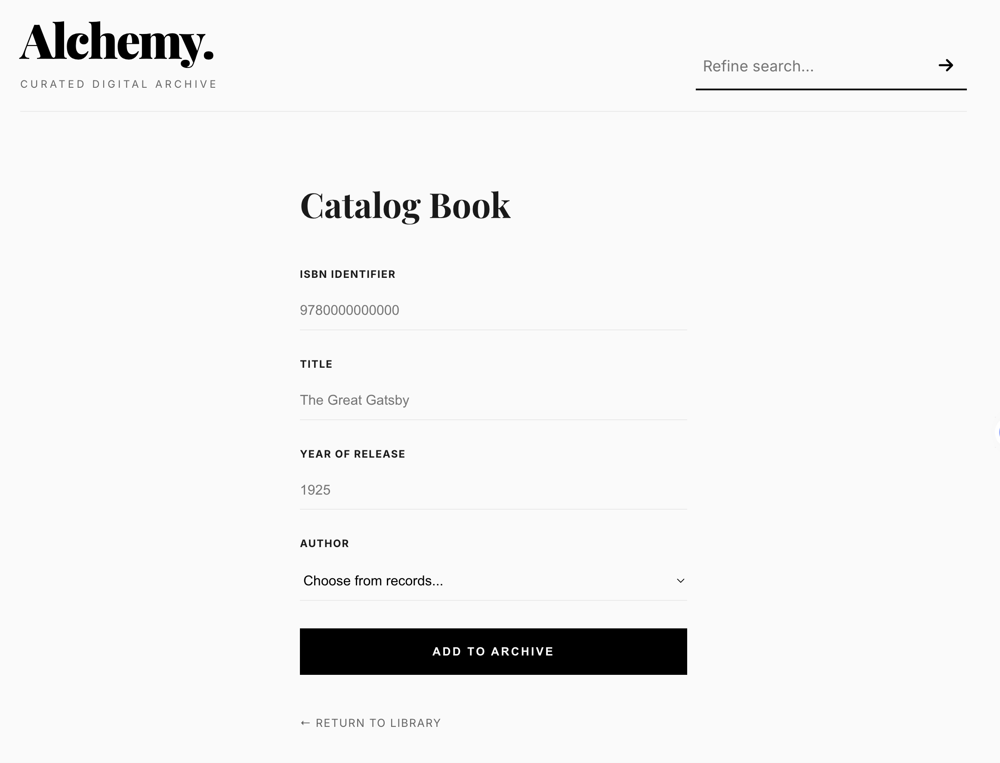

# 📚 Book Alchemy


**Book Alchemy** is a sophisticated, minimalist web application designed for bibliophiles to curate and manage their personal digital book archives. Built with Python and Flask, it features a high-end editorial design combined with powerful search and sorting capabilities.

## 🖼️ Screenshots

### Archive Dashboard

*Modern minimalist monochrome grid layout.*

### Detailed Record View

*High-quality book information with editorial typography.*

### Data Entry

*Clean and focused forms for authors and books.*

## ✨ Key Features

- **Personal Archive**: Add and manage your collection of authors and books.
- **Advanced Search**: Instant filtering by book titles or author names using case-insensitive search.
- **Dynamic Sorting**: Organize your library by Title, Author, or Publication Year.
- **Detailed Views**: Dedicated profile pages for authors (with full bibliographies) and detailed book views.
- **Modern UI**: A premium, minimalist monochrome design with responsive layouts and glassmorphic elements.
- **Safe Management**: Secure deletion of records with confirmation prompts.
- **Quality Code**: 100% PEP8 compliant with a perfect 10.0/10 Pylint score.

## 🛠️ Technology Stack

- **Backend**: Python 3.13, Flask
- **Database**: SQLite with Flask-SQLAlchemy (ORM)
- **Frontend**: HTML5, Modern CSS3
- **Icons**: FontAwesome 6
- **Typography**: Playfair Display (Serif), Inter (Sans-serif)

## 📂 Project Structure

```text
.
├── app.py              # Main Flask application & routes
├── data_models.py      # Database models (Author & Book)
├── screenshots/        # Project screenshots
├── static/
│   └── css/
│       └── style.css   # Custom minimalist design system
└── templates/          # Jinja2 HTML templates
```

## 🚀 Getting Started

1. **Install dependencies**:
   ```bash
   pip install Flask Flask-SQLAlchemy
   ```

2. **Run the application**:
   ```bash
   python app.py
   ```

3. **Access the library**:
   Open [http://localhost:5001](http://localhost:5001) in your browser.

---
*Developed with ❤️ for book lovers.*
